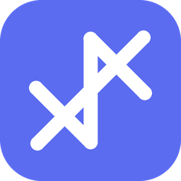

[h-cl-h/KnotJot](https://github.com/h-cl-h/KnotJot)

<div align="center">
  
  <h1>KnotJot</h1>
  <p><b>A flexible, local-first mind-mapping tool for Windows</b></p>
  <p>Capture ideas · Connect thoughts · Shape your own workspace</p>
</div>

---

## English

### Meet KnotJot

KnotJot is a free, open-source desktop app for mind mapping, planning, and visual note-taking. It works without a required account, keeps core editing local, and saves each map as a readable `.knotjot` JSON file on your computer. Legacy `.bmap` files remain supported for opening.

V1.0.0 is the first fully branded KnotJot release. The app, installer, settings directory, shortcuts, file association, window titles, exported presets, and internal live-sync formats all use the KnotJot name.

### What you can do

- **Choose the right structure** — create brace maps, spider-web maps, logic charts, org charts, trees, timelines, fishbones, matrices, and tree tables. A whole map or a single branch can use a different structure.
- **Keep several canvases in one file** — add, rename, delete, and switch sheets from the bottom tabs, or open a branch in its own sheet.
- **Arrange freely or tidy automatically** — drag topics anywhere, use alignment guides and magnetic snapping, adjust spacing, or restore a clean layout with Smart Tidy.
- **Work quickly from the keyboard** — add children and siblings, rename or move topics, and remap shortcuts in Settings.
- **Edit from the outline** — reorganize the hierarchy, change parents, collapse sections, and update task progress in a synchronized linear view.
- **Add useful details** — attach markers, tags, notes, hyperlinks, inline images, assignees, dates, progress, and a movable marker legend.
- **Plan with Gantt view** — turn topic dates and progress into a visual schedule, then jump from a Gantt bar back to its topic.
- **Customize text boxes** — use built-in or user-created styles, control fonts and input rules, resize freely or keep a fixed aspect ratio, and apply styles to one or many boxes.
- **Change the whole workspace** — switch built-in UI skins, import custom skins, and edit the original UI colors and canvas background.
- **Use AI only when you want it** — connect your own compatible model endpoint and API key. Normal editing does not require AI.

### Appearance and image backgrounds

With the original UI selected, open **Settings → Appearance** to edit the canvas, grid, cards, text, toolbar, menus, connectors, and start-page colors. These color controls affect only the original UI and do not overwrite imported skins.

Canvas backgrounds support PNG, JPEG, and WebP. KnotJot does not impose its own file-size or pixel-dimension limit. After importing an image, use the preview before applying it:

- **Unlimited canvas** repeats the image across the working area at the selected scale.
- **Limited canvas** creates a bounded workspace. The default is **6000 × 3600**, and the canvas size, image scale, and image position remain adjustable.
- The grid stays behind imported images instead of covering the photograph.
- Preview zoom changes the background scale while the empty reference text box stays at a stable screen size.
- Applying the appearance saves it for reopening and makes it the default for newly created maps. The active map also stores its own appearance in the `.knotjot` file.

### Live UI editing

KnotJot can watch its UI skin library while running. A compatible UI editor can save a skin to the connected library, and the open app refreshes it without restarting or losing the current map, selection, zoom, or text-editing state.

UI skins and text-box styles use separate libraries and separate style scopes, so changing one does not overwrite the other.

### Download and run

KnotJot V1.0.0 is provided for **Windows x64**.

1. Open the repository's **Releases** page.
2. Download `KnotJot-Setup-1.0.0.exe`.
3. Run the installer and choose an installation folder.
4. Start KnotJot from the desktop or Start menu.

The release is not commercially code-signed, so Windows may show an Unknown Publisher or SmartScreen warning. Verify that the file came from the official repository before running it.

### Your data and privacy

- Maps are saved to locations you choose.
- Core editing works locally and does not require an account.
- UI skins, text-box styles, and appearance preferences are stored in KnotJot's local settings directory.
- An API key is used only when you configure and invoke an AI endpoint. Keep the key private and review that provider's privacy policy.

### Run from source

Requirements: Node.js 18 or later and npm.

```bash
npm install
npm start
```

Build the Windows package with:

```bash
npm run dist:win
```

### License

KnotJot is licensed under **GPL-3.0-only**. Commercial use is allowed, but distributed derivative versions must follow the GPL requirements and provide corresponding source code. Bundled libraries and fonts keep their own compatible licenses; see [LICENSE](LICENSE) and [THIRD_PARTY_NOTICES.md](THIRD_PARTY_NOTICES.md).

---

## 中文

### 认识 KnotJot

KnotJot 是一款免费、开源的 Windows 桌面思维导图工具，也可以用来做计划和可视化笔记。正常使用不强制登录，核心编辑功能在本地运行，每份导图都以可读的 `.knotjot` JSON 文件保存在你的电脑上；旧版 `.bmap` 文件仍可打开。

V1.0.0 是第一份完整使用 KnotJot 品牌的正式版本。程序、安装包、设置目录、快捷方式、文件关联、窗口标题、导出的预设和内部实时同步格式都统一使用 KnotJot 名称。

### 你可以用它做什么

- **按想法选择结构**——支持大括号图、蜘蛛网图、逻辑图、组织结构图、树状图、时间轴、鱼骨图、矩阵和树形表格；可以切换整张导图，也可以只改变一个分支。
- **一个文件放多张画布**——通过底部标签新增、改名、删除和切换画布，也可以把某个分支单独放进新画布。
- **自由摆放，也能自动整理**——主题可以随意拖动，可使用对齐参考线和磁吸、调整间距，或用智能整理恢复清晰布局。
- **用键盘快速建图**——快速添加子级和同级、重命名或移动主题，并可在设置中重新录制快捷键。
- **在大纲中编辑**——用线性方式调整层级、改变父级、折叠内容和更新任务进度，画布会保持同步。
- **给主题补充信息**——添加标记、标签、备注、超链接、节点图片、负责人、日期、进度和可拖动的标记图例。
- **用甘特图做计划**——把主题日期与进度变成时间轴，点击甘特条即可回到对应主题。
- **自定义文本框**——使用内置或自制样式，调整字体和输入规则，选择自由拉伸或固定长宽比，并可批量应用。
- **改变整个工作区**——切换内置 UI、导入自定义 UI，并修改原版 UI 的颜色和画布背景。
- **按需使用 AI**——连接你自己的兼容模型地址和 API Key；普通编辑不依赖 AI。

### 外观与图片背景

使用原版 UI 时，打开 **设置 → 外观**，可以调整画布、网格、卡片、文字、工具栏、菜单、连接线和开始页颜色。这些配色选项只作用于原版 UI，不会覆盖导入皮肤自己的设计。

画布背景支持 PNG、JPEG 和 WebP。KnotJot 本身不设置文件体积或图片像素尺寸上限。导入图片后会先进入预览，再决定是否应用：

- **不限制画布大小**：按照选择的比例，在工作区中重复平铺图片。
- **限制画布大小**：建立有边界的工作区，默认从 **6000 × 3600** 开始，画布大小、图片比例和图片位置都可调整。
- 导入图片后，网格位于图片后方，不会覆盖照片表面。
- 预览缩放只改变背景的显示比例，空白参考文本框保持稳定的屏幕尺寸。
- 应用外观后，重新打开设置仍会保留，并成为新建导图的默认背景；当前导图也会把自己的外观写入 `.knotjot` 文件。

### UI 实时编辑

KnotJot 运行时会监听自己的 UI 皮肤库。兼容的 UI 编辑器把皮肤保存到已连接的库后，正在运行的程序可以直接刷新，不需要重启，也不会丢失当前导图、选择、缩放或文字编辑状态。

UI 皮肤和文本框样式使用不同的样式库与作用域，修改其中一个不会覆盖另一个。

### 下载和运行

KnotJot V1.0.0 面向 **Windows x64**。

1. 打开仓库的 **Releases** 页面。
2. 下载 `KnotJot-Setup-1.0.0.exe`。
3. 运行安装程序并选择安装位置。
4. 从桌面或开始菜单启动 KnotJot。

当前版本没有商业代码签名，因此 Windows 可能显示“未知发布者”或 SmartScreen 提示。运行前请确认文件来自官方仓库。

### 数据与隐私

- 导图保存在你选择的位置。
- 核心编辑在本地完成，不需要账号。
- UI 皮肤、文本框样式和外观偏好保存在 KnotJot 的本地设置目录中。
- 只有在你配置并调用 AI 接口时，程序才会使用 API Key。请妥善保管密钥，并了解对应服务商的隐私政策。

### 从源码运行

需要 Node.js 18 或更高版本以及 npm。

```bash
npm install
npm start
```

构建 Windows 版本：

```bash
npm run dist:win
```

### 开源许可

KnotJot 采用 **GPL-3.0-only**。允许商业使用，但如果分发修改版，需要遵守 GPL 并提供对应源代码。随程序提供的第三方库和字体继续使用各自的兼容许可证，详情见 [LICENSE](LICENSE) 和 [THIRD_PARTY_NOTICES.md](THIRD_PARTY_NOTICES.md)。
